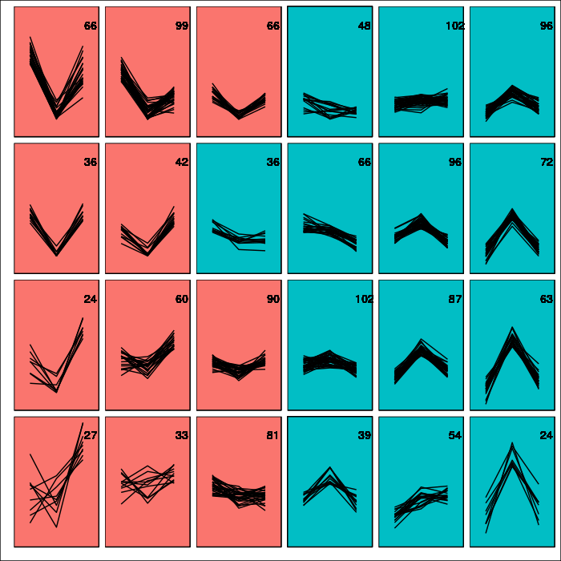
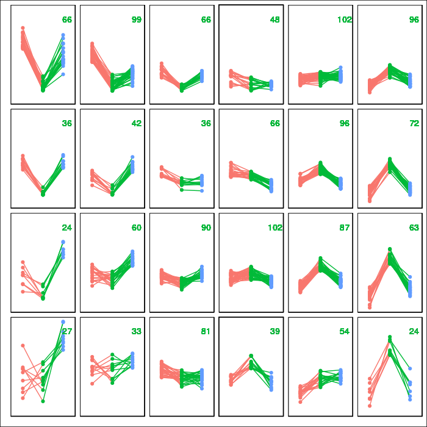

[](https://travis-ci.org/odlipe/ggsom)

# ggsom
ggplot extension to visualize Soms data

## Installing Requirements
```r
# Install the package
devtools::install_github("oldlipe/ggsom")

install.packages("kohonen")

# The easiest way to get ggplot2 is to install the whole tidyverse:
install.packages("tidyverse")

install.packages("dplyr")
install.packages("ggthemes")
```
## Usage

```r

NBA <-  read.csv(text = getURL("https://raw.githubusercontent.com/clarkdatalabs/soms/master/NBA_2016_player_stats_cleaned.csv"), sep = ",", header = T, check.names = FALSE) 

# Chosing columns
NBA.measures1 = c("FTA", "2PA", "3PA")

# Defining the som model
nba.som <- som(scale(NBA[NBA.measures1]), grid = somgrid(6, 4, "rectangular"))


```
- Full code can be find [here](https://clarkdatalabs.github.io/soms/SOM_NBA)

## Build the model used in plot function
```r
model.som <- generate.model.result(nba.som,cutree=TRUE,
                                   cutree.value = 2,
                                   grid.mark = TRUE)

```
## Examples of plot

```r
  # Division with numbers of neuron in each grid
  visualize.cluster.numbers(model.som)

```


```r
  # Amount of neuron per grid with color
  visualize.numbers(model.som,colour=TRUE)
```


