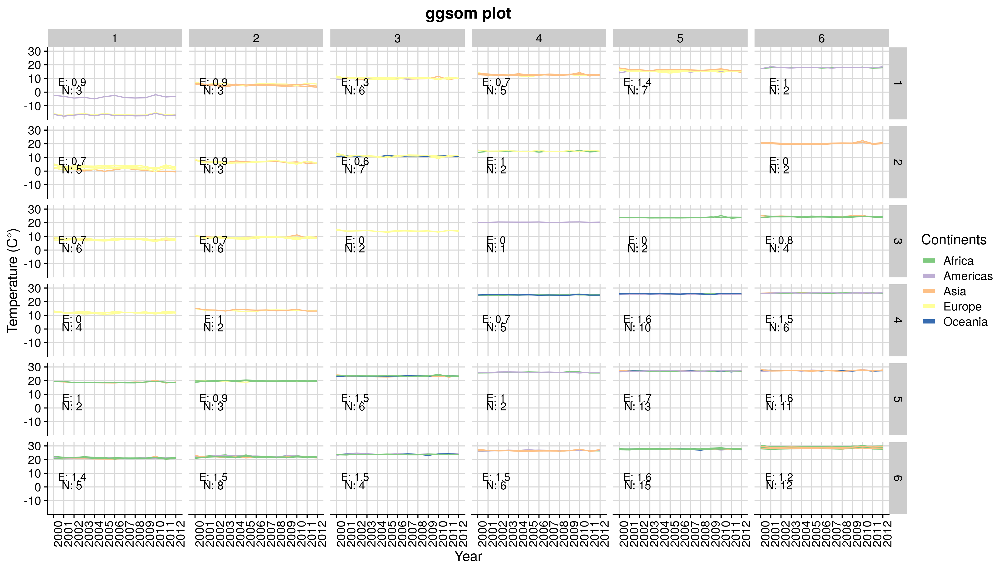

# ggsom 

[](https://travis-ci.org/OldLipe/ggsom/)
[](https://CRAN.R-project.org/package=ggsom)
[](http://www.r-pkg.org/pkg/ggsom)


## Overview
The aim of this package is to offer more variability of graphics based on the self-organizing maps (SOM). The SOM (Kohonen, 1982) is an unsupervised neural network that uses the competitive learning process to map multidimensional input vectors into a low-dimensional rectangular or hexagonal two-dimensional grid. In short, output nodes compete for input vectors, and at the end of each iteration the winning node (BMU) is determined, the one with the shortest euclidean distance to the input vector. After choosing the BMU, all the neighboring nodes of a certain radius, update their values in order to approach the chosen pattern (Kohonen, 2013). 

The tool developed in this work is based on two packages of programming language R: **Kohonen** (Wehrens & Buydens, 2007) and **ggplot2** (Wickham, 2011). The **Kohonen** package is used to train the SOM and the **ggplot2** to create the parallel coordinate graph. Thus, the **ggsom** package operates as a utility between the two above mentioned packages, in order to model the data generated by **Kohonen** and visualize it in **ggplot2**.

## Installing Requirements
```r
# Easiest way to install this package
devtools::install_github("oldlipe/ggsom")

# Or using CRAN repository
install.packages("ggsom")

# Functions to train self-organising maps (SOMs)
install.packages("kohonen")

# The easiest way to get ggplot2:
install.packages("ggplot2")
```
## Basic example of using the `ggsom` package

```r
# ggplot2 package import
library(ggplot2) 

# use iris dataset
data(iris)

# Creation SOM - 5x5
iris_som <- kohonen::som(X = as.matrix(iris[1:4]),
                        grid =  kohonen::somgrid(xdim = 5,
                                                 ydim = 5,
                                                 neighbourhood.fct = "gaussian",
                                                 topo = "rectangular"),
                        rlen = 100)
                        
# Using the ggsom package
ggsom::geom_class(iris_som, class = iris$Species,
                  x_o = 1, y_o = 5.8, x_e = 1.1, y_e = 7.4)
```


In the upper left corner of each neuron is shown the number of observations associated with each neuron (N) and its respective purity measured by entropy (E).

## Example of customization 

```r
library(cowplot) # themes ggplot2
theme_set(theme_cowplot())

# Using the ggsom package
ggsom::geom_class(iris_som, class = iris$Species,
                  x_o = 1, y_o = 5.8, x_e = 1.1, y_e = 7.4) +
  labs(x = "Attributes", y = "Values", title = "ggsom plot",
       caption = "Source: Felipe")  +
  scale_color_manual(name = "Classes",
                     labels = c("setosa", "versicolor", "virginica"),
                     values = c("#ffd319", "#005500", "#ff0000")) +
  background_grid(minor = 'none') +
  panel_border()

```


## Time series example

In this example we will use data from [earth surface climate change](https://www.kaggle.com/berkeleyearth/climate-change-earth-surface-temperature-data) from the [kaggle](kaggle.com/) platform. To define the continents of each country this [database](https://www.kaggle.com/statchaitya/country-to-continent) was used.

```r
library(readr)   # read rectangular data
library(dplyr)   # data manipulation
library(tidyr)   # functions to transform data to tidy
library(cowplot) # themes ggplot2

theme_set(theme_cowplot())

# Reading of temperature data  
temperature_countries <- readr::read_csv("./example/GlobalLandTemperaturesByCountry.csv")

# Reading and selection of continent data
continent <- readr::read_csv("./example/countryContinent.csv") %>%
  dplyr::select(country, continent)
  
# Filter from year 2000 and aggregation by annual mean (not good approach)
year_temperature <- temperature_countries %>% 
  dplyr::group_by(Country) %>%
  dplyr::filter(dt > "2000-01-01")  %>%
  dplyr::mutate(dt = lubridate::year(dt)) %>%
  dplyr::group_by(Country, dt) %>%
  dplyr::summarise(year_mean = mean(AverageTemperature))
  
# Joining the continents by the name of the countries  
final_dataset <- year_temperature %>% 
  dplyr::rename(country = Country) %>%
  dplyr::left_join(continent, by="country") %>%
  dplyr::filter(!is.na(continent)) %>%
  tidyr::pivot_wider(names_from = dt, values_from=year_mean) %>%
  dplyr::select(-`2013`)
  
# Write the final dataset on ext/inst (you can use it directly) 
write.csv(final_dataset, "./inst/extdata/climate_changes_annual.csv")

# Transforming into a matrix
matrix_temperature <- final_dataset %>% dplyr::ungroup() %>%
  dplyr::select(-country, -continent) %>% as.matrix()
  

# Creating a SOM network
som_temperature <- kohonen::som(X = matrix_temperature,
             grid = kohonen::somgrid(xdim = 6,
                                     ydim = 6,
                                     neighbourhood.fct = "gaussian",
                                     topo = "rectangular"),
             rlen = 1000)
             

# Using the ggsom tool
ggsom::geom_class(som_obj, class = final_dataset$continent,
                  x_o = 2.8, y_o = 1.3, x_e = 2.8, y_e = 7.4) +
  labs(x = "Year", y= "Temperature (C°)", title = "ggsom plot") +
  scale_color_manual(name = "Continents",
                     labels = c("Africa", "Americas", "Asia", "Europe", "Oceania"),
                     values = c("#7fc97f", "#beaed4", "#fdc086", "#ffff99", "#386cb0")) +
  background_grid(minor = 'none')
```



## Acknowledgments
- Rafael Santos

## References

- Kohonen, T. (1982). Self-organized formation of topologically correct feature maps. Biological cybernetics, 43(1):59–69.
- Kohonen, T. (2013). Essentials of the self-organizing map. Neural Networks, 37:52 – 65.
- Wehrens, R., Buydens, L. M., et al. (2007). Self-and super-organizing maps in r: the kohonen package. Journal of Statistical Software, 21(5):1–19.
- Wickham, H. (2011). ggplot2. Wiley Interdisciplinary Reviews: Computational Statistics, 3(2):180–185.


