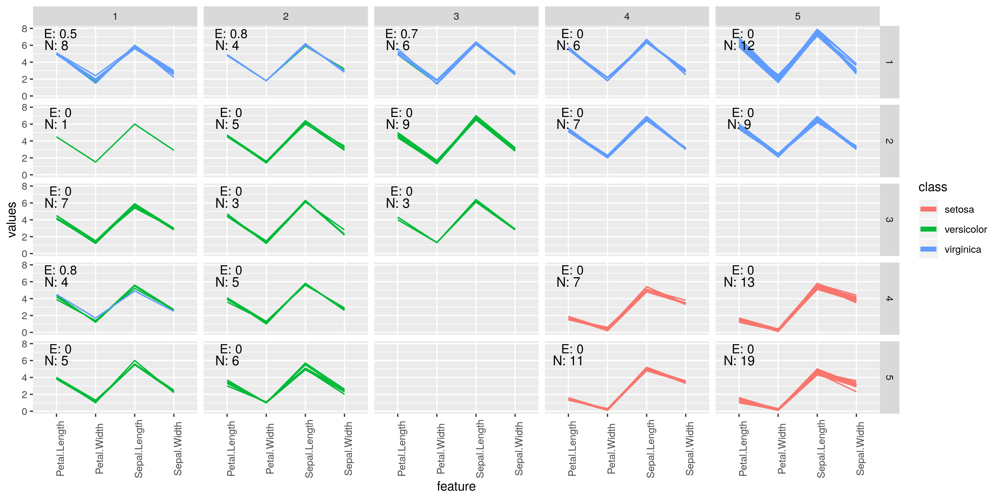
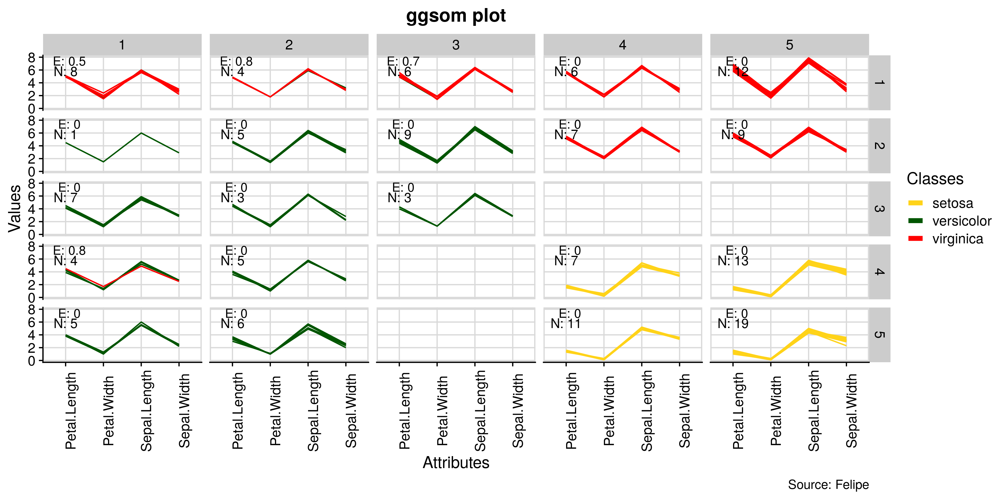

[](https://travis-ci.org/OldLipe/ggsom/)
[](https://CRAN.R-project.org/package=ggsom)
[](http://www.r-pkg.org/pkg/ggsom)


# ggsom 
The aim of this package is to offer more variability of graphics based on the self-organizing maps


## Installing Requirements
```r
# Easiest way to install this package
devtools::install_github("oldlipe/ggsom")

# Or using CRAN repository
install.packages("ggsom")

# Functions to train self-organising maps (SOMs)
install.packages("kohonen")

# The easiest way to get ggplot2:
install.packages("ggplot2")
```
## Basic example of using the `ggsom` package

```r
# ggplot2 package import
library(ggplot2) 

# use iris dataset
data(iris)

# Creation SOM - 5x5
iris_som <- kohonen::som(X = as.matrix(iris[1:4]),
                        grid =  kohonen::somgrid(xdim = 5,
                                                 ydim = 5,
                                                 neighbourhood.fct = "gaussian",
                                                 topo = "rectangular"),
                        rlen = 100)
                        
# Using the ggsom package
ggsom::geom_class(iris_som, class = iris$Species,
                  x_o = 1, y_o = 5.8, x_e = 1.1, y_e = 7.4)
```



In the upper left corner of each neuron is shown the number of observations associated with each neuron (N) and its respective purity measured by entropy (E).

## Example of customization 

```r
library(cowplot) # themes ggplot2
theme_set(theme_cowplot())

# Using the ggsom package
ggsom::geom_class(iris_som, class = iris$Species,
                  x_o = 1, y_o = 5.8, x_e = 1.1, y_e = 7.4) +
  labs(x = "Attributes", y = "Values", title = "ggsom plot",
       caption = "Source: Felipe")  +
  scale_color_manual(name = "Classes",
                     labels = c("setosa", "versicolor", "virginica"),
                     values = c("#ffd319", "#005500", "#ff0000")) +
  background_grid(minor = 'none') +
  panel_border()

```




## Acknowledgments
- Rafael Santos


