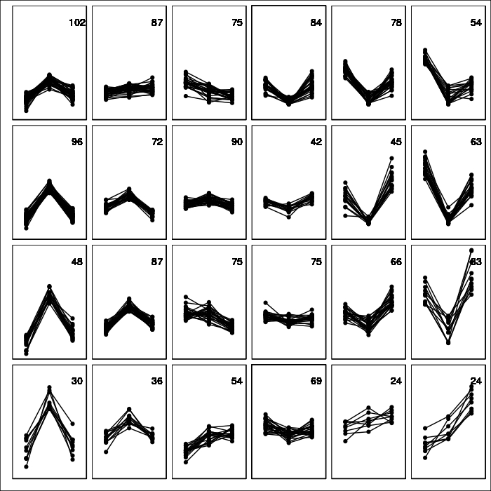
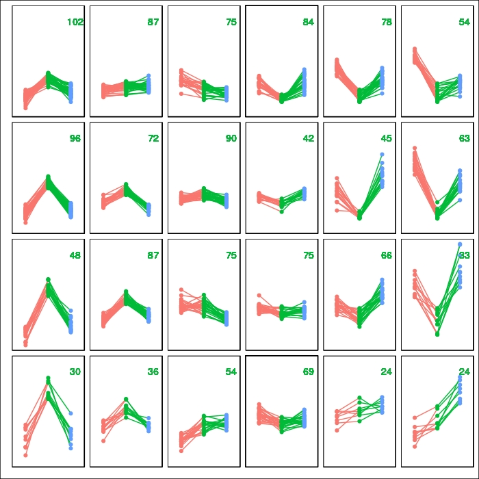

[](https://travis-ci.org/OldLipe/ggsom/)
[](https://CRAN.R-project.org/package=ggsom)

# ggsom
ggplot extension to visualize Soms data

## Installing Requirements
```r

# Easiest way to install this package
devtools::install_github("oldlipe/ggsom")

# Functions to train self-organising maps (SOMs)
install.packages("kohonen")


# The easiest way to get ggplot2 and dplyr is to install the whole tidyverse:
install.packages("tidyverse")

# Themes for ggplot2
install.packages("ggthemes")
```
## Example of SOMs object

```r
library (RCurl)

NBA <- read.csv(text = getURL("https://raw.githubusercontent.com/clarkdatalabs/soms/master/NBA_2016_player_stats_cleaned.csv"), sep = ",", header = T, check.names = FALSE) 


# Chosing columns
NBA.measures1 = c("FTA", "2PA", "3PA")

# Defining the som model
nba.som <- som(scale(NBA[NBA.measures1]), grid = somgrid(6, 4, "rectangular"))


```
- Full code can be found [here](https://clarkdatalabs.github.io/soms/SOM_NBA)


## Examples of ggsom_line

```r
  # Set FALSE for a colorless chart
  ggsom_line(aes_som(nba.som), FALSE)

```


```r
  # TRUE for a color chart
  ggsom_line(aes_som(nba.som), TRUE)
```



## Examples of division clusters plots

```r
  # Division grid per colors 
  ggsom_ribbon(aes_som(nba.som, 4), TRUE)
  

```


